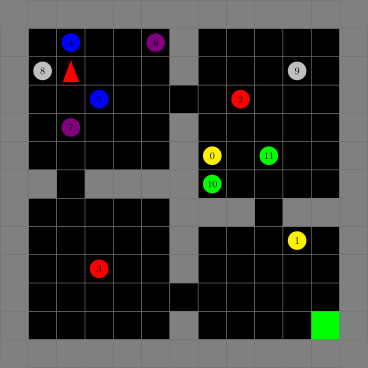
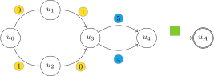

# FORM: Learning Expressive and Transferable First-Order Logic Reward Machines

[](https://arxiv.org/abs/2501.00364)


## Abstract

Reward machines (RMs) are an effective approach for addressing non-Markovian rewards in reinforcement learning (RL) through finite-state machines. Traditional RMs, which label edges with propositional logic formulae, inherit the limited expressivity of propositional logic. This limitation hinders the learnability and transferability of RMs since complex tasks will require numerous states and edges. To overcome these challenges, we propose First-Order Reward Machines (FORMs), which use first-order logic to label edges, resulting in more compact and transferable RMs. We introduce a novel method for _learning_ FORMs and a multi-agent formulation for _exploiting_ them and facilitate their transferability, where multiple agents collaboratively learn policies for a shared FORM. Our experimental results demonstrate the scalability of FORMs with respect to traditional RMs. Specifically, we show that FORMs can be effectively learnt for tasks where traditional RM learning approaches fail. We also show significant improvements in learning speed and task transferability thanks to the multi-agent learning framework and the abstraction provided by the first-order language.


<div style="display: grid; grid-template-columns: auto auto auto;">
  <div style="grid-column: 1;
  grid-row: 1 / span 2; padding: 4px">
	
  </div>
  <div style="grid-column: 2;
  grid-row: 1; display: flex; padding: 4px">
	
  </div>
  <div style="grid-column: 2;
  grid-row: 2; display: flex; padding: 4px">
	
  </div>
</div>

## Setup

Python 3.10.12

```shell
# clone the repo
git clone https://github.com/leoardon/form.git
cd form

# create virtual environment
python -m venv .venv

# activate the environment
source .venv/bin/activate

# install dependencies
python -m pip install -U pip pypatch
python -m pip install -r requirements.txt

# apply patch
pypatch apply `pwd`/patches/ray.patch ray
```

ILASP installation
```shell
wget https://github.com/ilaspltd/ILASP-releases/releases/download/v4.4.0/ILASP-4.4.0-ubuntu.tar.gz

mkdir ILASP
tar -xvzf ILASP-4.4.0-ubuntu.tar.gz -C ./ILASP/
mv ./ILASP/ILASP .venv/bin/
rm -rf ILASP
```

## Run

```shell
python src/run.py [--rm] [--rm_learning] [--prop] [--shared_policy] --env ["FOLRoom-AllYellow-2"|"FOLRoom-GreenButOne-NoLava"|"FOLRoom-Blue-AllYellow-7"|"FOLRoom-AllYellow-4"|"FOLRoom-AllYellow-6"]
```

- the `rm` flag indicates whether to use PPO with RM or just PPO.
- the `rm_learning` flag is used to learn the RM along with the policies.
- the `prop` flag is used to learn a Propositional RM instead of a $\texttt{FORM}$.
- the `shared_policy` flag is used to learn a RM using a CRM-like approach with a single policy learnt.
- the `env` option is used to specify the environment.

## Cite us

```
@inproceedings{ardonFORM25,
	title        = {{\texttt{FORM}: Learning Expressive and Transferable First-Order Logic Reward Machines}},
	author       = {Ardon, Leo and Furelos Blanco, Daniel and Para\'c, Roko and Russo, Alessandra},
	year         = 2025,
	booktitle    = {Proceedings of the 24th International Conference on Autonomous Agents and Multiagent Systems},
	location     = {Detroit, U.S.A.},
	series       = {AAMAS '25},
}
```
